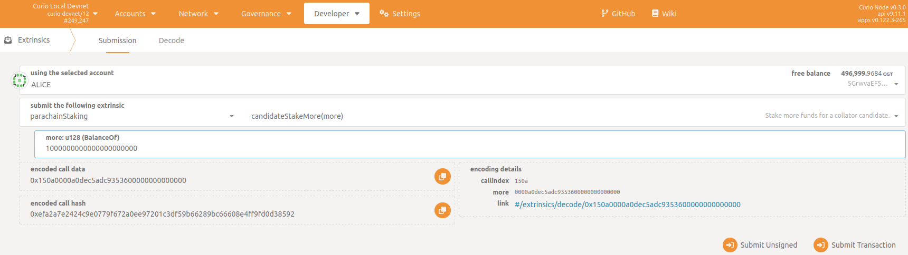
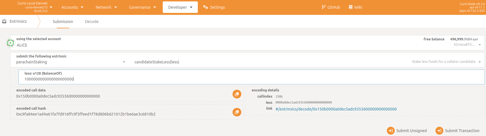

# Adjust Your Own Stake

A collator can increase or decrease their stake, always within the limits of the minimum and maximum allowed stake amounts. The corresponding extrinsics for these operations are `parachainStaking -> candidateStakeMore(more)` and `parachainStaking -> candidateStakeLess(less)`.

In the Polkadot JS Apps go to `Developer -> Extrinsics -> Submission`.

Candidate Stake more:

Candidate Stake less:

1. Select your collator Curio address as the extrinsic submitter (the *using the selected account* field)
2. Select the extrinsic: `parachainStaking -> collatorStakeMore`
3. Choose the stake amount that you want to add or remove from your current stake (the *more* field).
You can add up to the maximum of 200,000 CGT and your maximum available balance.
4. Sign and submit the extrinsic (the *Submit Transaction* button)