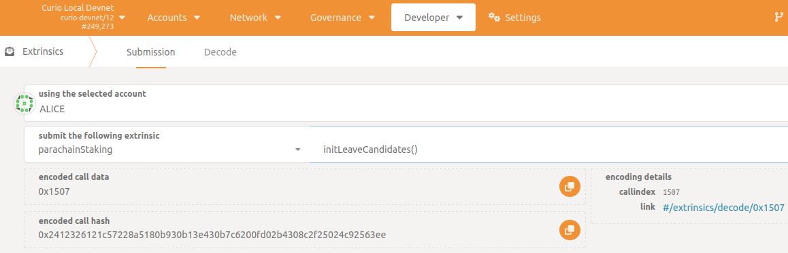
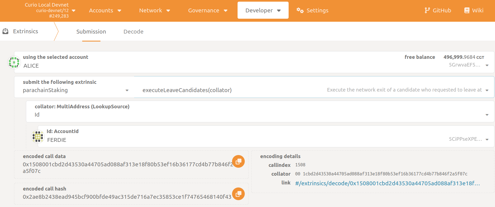
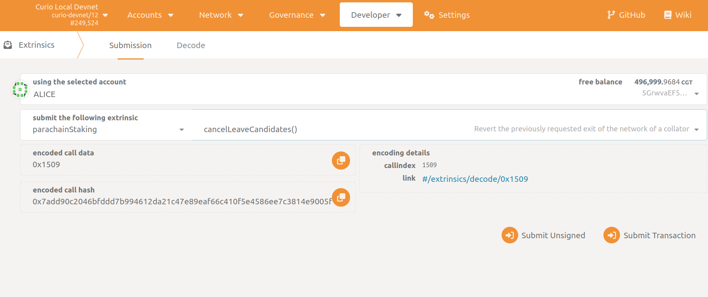

# Leave the Collator Candidate Pool

If you intend to stop collating or stop being a collator candidate, you have to go through three stages until your staked tokens are unlocked and your collator state is purged from the chain.

> 💡 Unfortunately, exiting is not a simple process for security reasons. Since a picture paints a thousand words, you can find a visualization of this process in the following [lifecycle section](LifecycleOfACollator.md).

## **Initiate the Exit Request**

First, signal your intent by calling `parachainStaking -> initLeaveCandidates`.You will then be removed from the `CandidatePool` and your state switches from `Active` to `Leaving(leaveRound)`, where `leaveRound`  reflects the number of sessions in which you can actually leave. You still need to stay online and build blocks for the current and next sessions.
Of course, you will continue to receive rewards for your authored blocks. A leaving candidate cannot be selected as an active collator for the sessions from this point on. Moreover, you cannot receive new delegations and existing delegations cannot be adjusted. However, delegations can still be revoked.

In the Polkadot JS Apps go to `Developer -> Extrinsics -> Submission`.

1. Select your collator Curio address as the extrinsic submitter (the *using the selected account* field)
2. Select the appropriate extrinsic: `parachainStaking -> initLeaveCandidates`
3. Sign and submit the extrinsic (the *Submit Transaction* button)

## **Execute the Exit Request**

Next, after waiting until the `leaveRound`-th session, you can call `executeLeaveCandidate` to remove all of your `Candidate` associated storage. You should be certain that you wish to leave as there is no turning back afterwards. If you wish to become a candidate at a later stage, you will have to apply again and will not have your former delegations.

1. Select one of your Curio addresses with sufficient funds to pay
for the transaction fee (~5 milli CGT) as the extrinsic submitter (the *using the selected account* field)
*NOTE: Of course, you can chose your collator account.*
2. Select the appropriate extrinsic: `parachainStaking -> executeLeaveCandidates`
3. Select the `Id` option (the *MultiAddress (LookupSource) field*)
4. Select the collator account (the *Id: AccountId* field)
5. Sign and submit the extrinsic (the *Submit Transaction* button)

## **Cancel the Exit Request**

You can still cancel your exit request by calling `cancelLeaveCandidates`  if you have not exited yet, and if the CandidatePool is not full already. Upon cancelling your exit intent, your state switches back to `Active` and you still have all delegations that were not revoked in the meantime. Moreover, if you are one of the top staked candidates, you will automatically become a collator in two rounds (~4 hours).

1. Select your collator Curio address as the extrinsic submitter (the *using the selected account* field)
2. Select the appropriate extrinsic: `parachainStaking -> cancelLeaveCandidates`
3. Sign and submit the extrinsic (the *Submit Transaction* button)

## **Unlock Your Stake**

If you have executed the exit request you cannot immediately unlock your previously staked tokens.
There is a delay of 7 days in block time before you can free them by calling `unlockUnstaked`.
See [here](../UnlockUnstakedTokens.md) for a step-by-step tutorial.