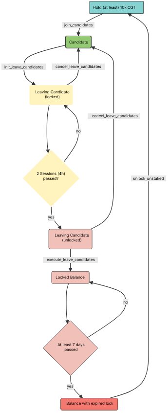

# Lifecycle of a Collator

The following diagram visualizes the full lifecycle of a collator from owning free CGT to joining the collator candidate pool, initiating the exit, waiting for the stake to be unlockable and eventually unlocking their bond.It summarizes the previous [exit](LeaveTheCollatorCandidatePool.md) section.

