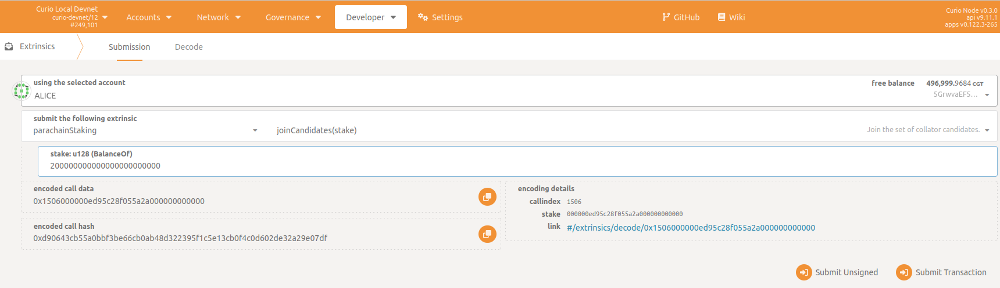
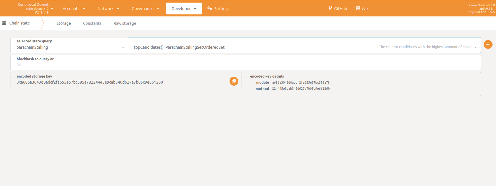
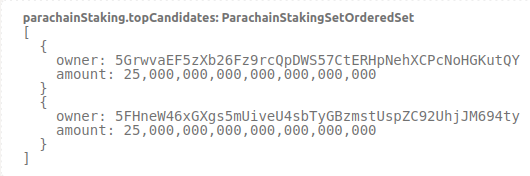

# Join the Collator Candidate Pool

Before a collator can author blocks, the node needs to fully sync up with both the Curio parachain and the Polkadot Relay Chain. Depending on the size of the blockchain states, it may take from a 
number of hours to few days for the node to fully synchronize. More details can be found on the [Polkadot network docs](https://wiki.polkadot.network/docs/maintain-guides-how-to-validate-kusama#synchronize-chain-data).

After you have finished with the setup, you can finally tell the chain that you are ready to collate and join the pool of candidates.

> 💡 These steps should be followed only once your collator node has successfully **[linked a session key to its address](SetAndRotateSessionKeys.md)**  and synced the parachain and relaychain states by following the previous steps.

## **Minimum Token Requirement**

In order to become a collator, you must stake

- at least *10,000 CGT* tokens and
- at most *200,000 CGT* tokens.

## **Execute the Joining Transaction**

The collator must call an extrinsic `parachainStaking -> joinCandidates(stake)`
 with the desired stake to join the candidate pool.

In the Polkadot JS Apps go to `Developer -> Extrinsics -> Submission`.

1. Select your collator Curio address as the extrinsic submitter (the *using the selected account* field)
2. Select the following extrinsic: `parachainStaking -> joinCandidates(stake)`
3. Insert the staked Curio amount for your collator (any value between `10,000,000,000,000,000,000,000` and `200,000,000,000,000,000,000,000`)
4. Sign and submit the extrinsic (the *Submit Transaction* button)

> 💡 A recent change in the blockchain metadata resulted in a change in the UI regarding how balances are shown.In the current version of PolkadotJS Apps, specifying 1 CGT requires adding 18 trailing `0`s.So, for instance, 1 CGT needs to be written as `1,000,000,000,000,000`, while 10,000 CGT would be written as `10,000,000,000,000,000,000`.

## **Check Your Position in the Collators Queue**

As a collator candidate you can check the current top candidates to see their position and the required staked amount to become an active collator, i.e., to start authoring new blocks.

In Polkadot JS go to `Developer -> Chain state -> Storage`

1. Selected state query: `parachainStaking -> topCandidates(): ParachainStakingSetOrderedSet`
2. Execute the query by pressing the "+" button on the right side

Now, you should see a window which lists collators (the *owner* field) ordered by their total stake (the *amount* field) from greatest to lowest.

If a collator has enough self-stake and delegator stake it will be selected to collate. The last address in the list will be the least staked candidate. A time period of two sessions must pass before the selected collator will be authoring blocks, e.g., after the remainder of the current session and the entire next one.