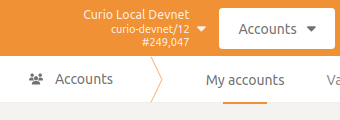

# Set and Rotate Session Keys

As a collator, you need to link your session keys to your collator account. Once linked, the keys are used to identify your collator node. Your collator address will receive the permit to build blocks, but the session keys pass this permit to your node. To check whether the account has already some session keys set, the RPC functions `author > hasKey(publicKey, keyType)`  and `author > hasSessionKeys(sessionKeys)` can be called.


> 💡 The session keys associate a collator node with an account on the blockchain. They are hot keys that must be kept online. It is recommended to change them throughout sessions

## **Generate New Session Keys**

> 💡 Make sure that no unauthorized party is able to access the RPC endpoint of the collator. Use SSH forwarding for the RPC port when needing to perform some RPC operations on the node with

```bash
ssh -L 127.0.0.1:9944:127.0.0.1:9944 <user>@<server>
```

There are three ways to create the session keys. We recommend using the curl command on the same host that the node is running or from a host that has an active SSH tunnel with it.
This way there is no need to add the `--unsafe-rpc-external` argument to the node.
Nevertheless, the session keys can also be rotated using the PolkadotJS Apps interface or by directly storing the new key in the node's keystore.

### curl

A collator can use the following command to rotate the session key.

```bash
curl -H "Content-Type: application/json" -d '{"id":1, "jsonrpc":"2.0", "method": "author_rotateKeys", "params":[]}' http://localhost:9933
```

The answer should look like the JSON object below. The `result` key is the HEX-encoded public part of the newly created session key.

```bash
{"jsonrpc":"2.0","result":"0xd8710ef4a83cbfd190a4dac56e89e091e24506a814244aca0bc94f257974b642","id":1}
```

### Apps

In order to use the PolkadotJS Apps UI, the node WebSocket endpoint must be reachable. This can be done either by publicly exposing it with the `--ws-external` flag, which is discouraged, or by setting up an SSH tunnel for the WebSocket endpoint with `ssh -L  127.0.0.1:9933:127.0.0.1:9933 <user>@<server>`. If the latter option is chosen, there is no need to have a separate SSH tunnel for RPC traffic as all the RPC operations can be performed directly from the now-accessible PolkadotJS Apps interface.




After connecting to the node, select `Developer -> RPC calls -> author -> rotateKeys()`
 from the menu. This will generate a new session key which replaces the existing one.


### Subkey

A keypair can be created using the [subkey tool](https://substrate.dev/docs/en/knowledgebase/integrate/subkey)  by following the steps in the tool's official documentation. The generated private and public keys can then be saved within the 
keystore folder of the collator node to be used as session keys.

```bash
❯ subkey generate -n curio
Secret phrase `very secure private key you should not use the example private key` is account:
  Secret seed:      0xcafe97b4b8f0adc1adeb3feef30bf2e5b9d49ddd897f268c8027c850DeadBEEF
  Public key (hex): 0xda3861a45e0197f3ca145c2c209f9126e5053fas503e459af4255cf8011d51010
  Account ID:       0xda3861a45e0197f3ca145c2c209f9126e5053asdg03e459af4255cf8011d51010
  SS58 Address:     4srC1aowD94H9UH9xsnfv7XV6oHU6dhCymKYZHWKsdddaP29
```

The name of the file must be the *public*  key prepended with `61757261` (HEX representation of `aura`) and without the `0x` prefix, while the content of the file has to be the secret phrase.


For instance, with the keypair generated in the example, the session key file would be stored at the path `./keystores 61757261da3861a45e0197f3ca145c2c209f9126e5053fas503e459af4255cf8011d51010`.

> 💡 The rotation of the session key should be done periodically to ensure that your collator can remain secure and safe from attacks. You can find more information about session keys in the [Substrate Documentation](https://docs.substrate.io/v3/concepts/session-keys/#generation-and-use).

Once a new session key is generated, you must then link that key to your collator account in order to receive rewards for producing new blocks. This operation is performed by submitting a signed extrinsic to the blockchain.

For Curio Parachain Mainnet, the endpoint is {TODO write link to Curio Parachain Mainnet}, while for Curio Parachain Testnet it is [Curio Parachain Testnet](https://polkadot.js.org/apps/?rpc=wss%3A%2F%2Ftestnet.parachain.curioinvest.com%3A9933#/explorer).

`Developer -> Extrinsics -> Submission`

1. Select your collator Curio address as the extrinsic submitter (the *using the selected account*
 field)
2. Set up the following extrinsic:

```bash
session -> setKeys(keys, proof)
```

- `keys` -> the public session key (`0xd8710ef4a83cbfd190a4dac56e89e091e24506a814244aca0bc94f257974b642` in the example above)
- `proof` -> the proof of ownership. It can be set to `0x00`
1. Sign and submit the extrinsic (the *Submit Transaction*
 button)


Once the extrinsic is executed, you will have linked the new session key to your account and can start receiving rewards for producing new blocks. However, the new session key does not become effective immediately but with the start of the next session.

## Storing keys in file

```bash
./target/release/curio-parachain-node key insert --base-path $HOME/data/keystore \
  --chain node/src/chain_specs/testnet-live-raw.json \#Write here your chain spec
  --scheme Sr25519 \
  --suri <You should write here your suri in ""> \
  --key-type aura
```