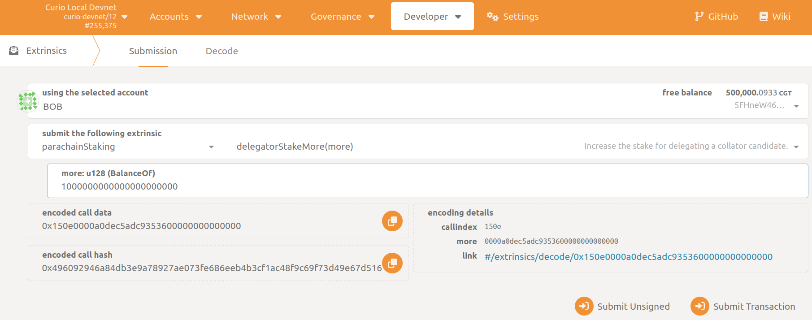

# Adjust Your Delegation Stake

A delegator can increase and decrease their stake by calling either  `parachainStaking -> delegatorStakeMore(more)`  or `parachainStaking -> delegatorStakeLess(less)`. Your adjustment becomes effective immediately! If you increase your stake, you will instantly receive higher rewards for any blocks produced by your collator; if you decreased your delegation amount, the reverse applies and you receive less rewards.

In the Polkadot JS Apps go to `Developer -> Extrinsics -> Submission`.

### Stake more:

1. Select the CGT address you want to delegate from as the extrinsic submitter (the *using the selected account* field)
2. Select the extrinsic: `parachainStaking -> delegatorStakeMore`
3. Select the `Id` option (the *MultiAddress (LookupSource) field*)
4. Select the collator account (the *Id: AccountId* field)
5. Choose the desired amount of stake that you want to add to your current stake.
You can add up to your maximum available balance.
6. Sign and submit the extrinsic (the *Submit Transaction* button)

### Stake less:

1. Select the CGT address you want to delegate from as the extrinsic submitter (the *using the selected account* field)
2. Select the extrinsic: `parachainStaking -> delegatorStakeLess`
3. Select the `Id` option (the *MultiAddress (LookupSource) field*)
4. Select the collator account (the *Id: AccountId* field)
5. Choose the desired amount of stake that you want to remove from your current
stake.
You can reduce down to the minimum delegation amount (1000 CGT), e.g.,
any value up to the difference of your current stake and the minimum
will be accepted.
6. Sign and submit the extrinsic (the *Submit Transaction* button)

> ⚠️ Caution!
You cannot adjust your stake if your Collator candidate is in the leaving state, e.g., they want to stop collating. However, you can still **[remove](Leave%20the%20Set%20of%20Delegators%20f3536ed1c47e45c48e820b54c4f7a56f.md)**  your delegation.