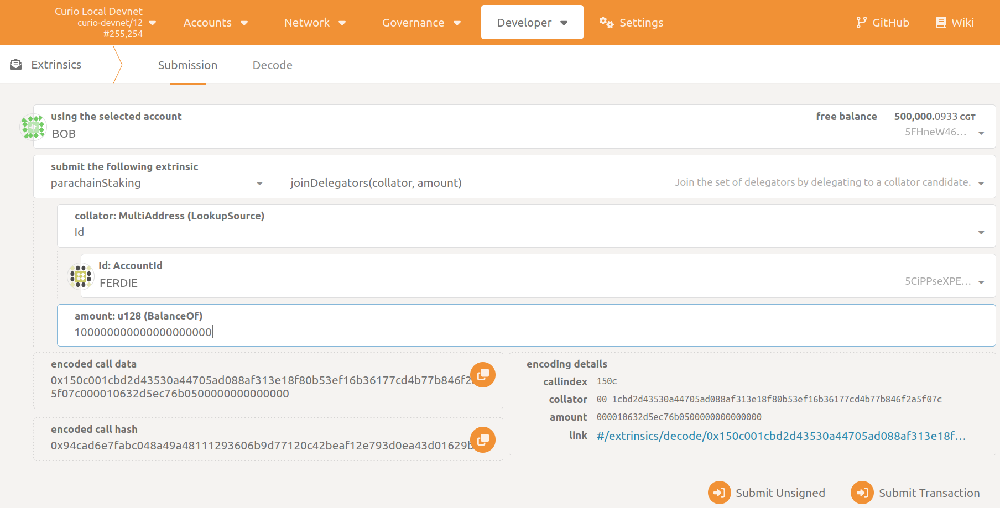
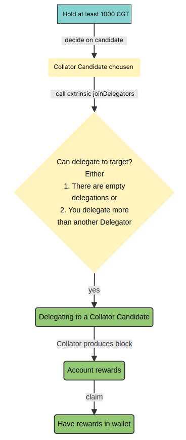
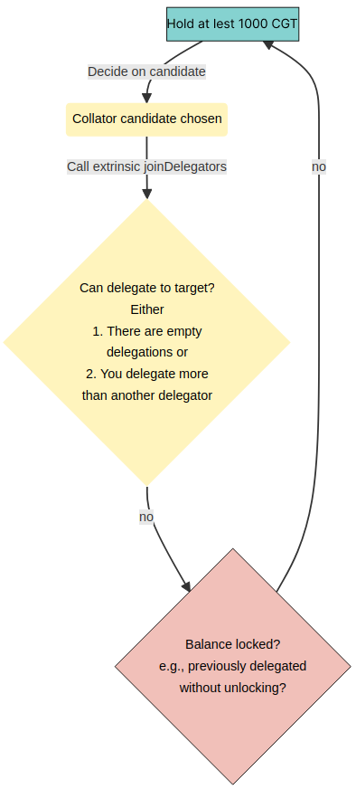

# Become a Delegator

In contrast to the rather difficult [path to become a collator candidate](../BecomeACollator/Overview.md) , joining the delegator pool is rather simple. Anyone can delegate to a collator candidate by staking a minimum of 1000 CGT and calling `parachainStaking -> joinDelegators`.

In the Polkadot JS Apps go to `Developer -> Extrinsics -> Submission`.

1. Select the Curio address you want to delegate from as the extrinsic submitter (the *using the selected account* field)
2. Select the appropriate extrinsic: `parachainStaking -> joinDelegators`
3. Select the `Id` option (the *MultiAddress (LookupSource) field*)
4. Select the collator account (the *Id: AccountId* field)
5. Choose the desired stake amount.
6. Sign and submit the extrinsic (the *Submit Transaction* button)

> 💡 Info\
A recent change in the blockchain metadata resulted in a change in the UI regarding how balances are shown. In the current version of PolkadotJS Apps, specifying 1 CGT requires adding 15 trailing `0`s. So, for instance, 1 CGT needs to be written as `1,000,000,000,000,000,000` , while 10,000 CGT would be written as `10,000,000,000,000,000,000,000`.

## **Happy Path**

If your chosen collator candidate has at least one empty slot in their delegation pool (out of 70 maximum slots at the time of writing), your delegation will be successful and you immediately start receiving rewards each time the collator you delegated produces a block.

>💡 Info\
If your chosen collator fails to produce blocks, neither the collator itself nor their delegators receive rewards. This can happen if the collator has connectivity issues or are not building blocks fast enough.

## **Unhappy Path**

If the delegation pool of your chosen collator candidate is full, you  may still delegate to them if you stake more than the current lowest delegator stake of that pool. When that happens,

- The kicked delegator will be replaced by the delegator with a higher delegation (you) immediately
- The kicked delegator's stake is prepared for unstaking as if they revoked the delegation
- A delegator needs to wait 7 days (in block time) to be able to unlock the stake. Please note that it can take longer in real time as the block times assumes a constant block time of 12s, which is not guaranteed.
    
    

> 💡 Info\
For now, an account can only delegate to one collator at any time! Moreover, you can only (re-) delegate, e.g., call `parachainStaking -> {joinDelegators, zelegateAnotherCandidate}`, once per staking round.
    
    