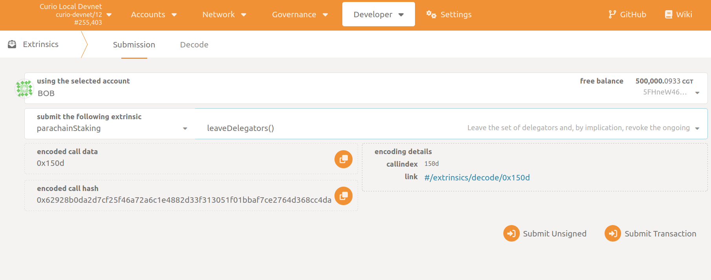

# Leave the Set of Delegators

A Delegator can revoke their delegation by calling `parachainStaking -> leaveDelegators`.
As a result, you won't receive any rewards immediately after the transaction is successfully executed.

- Your previously delegated amount will be prepared for unstaking.
- You need to wait 7 days (in block time) before you can unlock your unstaked tokens, see the section [Unlock Unstaked](../UnlockUnstakedTokens.md) for more information.
- Exiting does not count towards the limit of “1 delegation per round”.

In the Polkadot JS Apps go to `Developer -> Extrinsics -> Submission`.

1. Select the Curio address you delegated from as the extrinsic submitter (the *using the selected account* field)
2. Select the appropriate extrinsic: `parachainStaking -> leaveDelegators`.
3. Sign and submit the extrinsic (the *Submit Transaction* button)